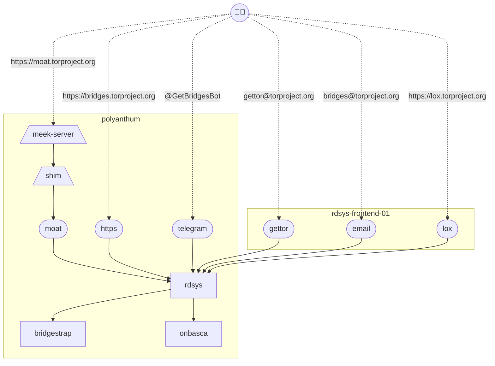

## General information

* Rdsys consists of several microservices. This document only covers rdsys's backend process whose name is rdsys-backend. For brevity, the rest of this document refers to the backend process as rdsys.
* Scripts and config files related to rdsys's deployment are in the [rdsys-admin](https://gitlab.torproject.org/tpo/anti-censorship/rdsys-admin) repository.
* Rdsys's systemd scripts are in rdsys-admin git repo.
* There's a crontab entry (run `crontab -e` as user rdsys in bridges.torproject.org) that invokes logrotate once a day to [rotate rdsys's log files](https://gitlab.torproject.org/tpo/anti-censorship/rdsys-admin/-/blob/master/logrotate/logrotate.conf).
* Take a look at [rdsys's metrics](https://bridges.torproject.org/rdsys-backend-metrics) for a quick check if the service is running.
* There is a staging server to test rdsys, see the [Rdsys Staging Survival Guide](https://gitlab.torproject.org/tpo/anti-censorship/team/-/wikis/Survival-Guides/Rdsys-Staging-Survival-Guide)

There are two servers where rdsys services live:

* bridges.torproject.org
  - Where the backend runs
  - moat and telegram distributors run there until we migrate them to rdsys-frontend.
  - The username is rdsys.
  - Its home directory is in /home/rdsys.
  - The backend listens on 127.0.0.1:7100.
* The rest of the distributors and updaters run on rdsys-frontend-01.torproject.org.
  - The user rdsys owns the binaries in /srv/rdsys.torproject.org/bin
  - rdsys user has a clone of rdsys-admin repo in /srv/rdsys.torproject.org/rdsys-admin, all the other users symlink systemd services from this repo
  - Each service has a user and a folder in /srv/, for example `gettor` has /srv/gettor.torproject.org/conf where the config of the service lives.
  - The services run under the user with the name of the service. For example `gettor` has two systemd services `gettor-distributor` and `gettor-updater`
  - The bridges@tpo email service runs under the `bridges-email` user with it's config file in `~/conf/email.json`



## (Re)starting rdsys backend

1. Log into bridges.torproject.org.
2. Change to the rdsys user by running `sudo -u rdsys -s`.
3. Update the rdsys-admin repo if needed `cd ~/rdsys-admin; git pull`
4. (Re)start the rdsys-backend process via its systemd script: `systemctl --user [start|stop|status] rdsys-backend`.
5. Take a look at rdsys's log file at /home/rdsys/logs/rdsys-backend.log to make sure that the service (re)started successfully.

## (Re)starting rdsys frontends

1. Log into rdsys-frontend-01.torproject.org.
2. Change to the rdsys user by running `sudo -u rdsys -s`.
3. Update the rdsys-admin repo if needed `cd /srv/rdsys.torproject.org/rdsys-admin; git pull`
4. Change to the service user by running `sudo -u gettor -s` or `sudo -u bridges-email -s`.
5. (Re)start the `gettor-distributor`, `gettor-updater`, or `email` process via its systemd script: `systemctl --user [start|stop|status] [gettor-<service>|email]`.
6. Take a look at the logs with `journalctl --user -f`.

## Deploying a new frontend service

1. [Open an issue with TPA](https://gitlab.torproject.org/tpo/tpa/team/-/issues/new) to create a new user on rdsys-frontend-01 for the service (see the [lox distributor issue](https://gitlab.torproject.org/tpo/tpa/team/-/issues/41330) for an example).
2. Create a service file for the new service and add it to the [rdsys-admin](https://gitlab.torproject.org/tpo/anti-censorship/rdsys-admin/-/tree/main/systemd?ref_type=heads) repository
3. Log into rdsys-frontend-01.torproject.org
4. Change to the `<service>` user by running `sudo -u <service> -s`
5. Create a symlink for the service in the user `$HOME` directory:

   ```
   ln -s /srv/rdsys.torproject.org/rdsys-admin/systemd/<service>.service ~/.config/systemd/users/
   ```
6. Enable the service: `systemctl --user enable <service>`
7. Start the service: `systemctl --user start <service>` (see wiki for help: https://gitlab.torproject.org/tpo/tpa/team/-/wikis/doc/services)
8. Check to make sure the service is running: `systemctl --user status <service>`

## Deploying a new backend version

1. Compile the binary disabling CGO: `CGO_ENABLED=0 go build ./cmd/backend`
2. Copy the binary to the server: `scp backend polyanthium:`
3. Log into polyanthium.
4. Change to the rdsys user by running `sudo -u rdsys -s`.
5. Make a copy of the old binary so we can roll back if there is any problem: \`mv <span dir="">\~</span>/bin/rdsys-backend <span dir="">\~</span>/bin/rdsys-backend.old
6. Copy the binary to its place: `cp /home/<user>/backend ~/bin/rdsys-backend`
7. Restart the service process via systemd: `systemctl --user restart rdsys-backend`.

## Deploying a new distributor version

1. Compile the binary disabling CGO: `CGO_ENABLED=0 go build ./cmd/distributors`
2. Depending on which distributor(s) you are targeting, copy the binary to the server: `scp distributors polyanthium:` and/or `scp distributors rdsys-frontend-01:`
3. Log into the server.
4. Change to the rdsys user by running `sudo -u rdsys -s`.

##### For polyanthum:

5. Make a copy of the old binary so we can roll back if there is any problem: `mv ~/bin/rdsys-distributors ~/bin/rdsys-distributors.old`
6. Copy the binary to its place: `cp /home/<user>/distributors ~/bin/rdsys-distributors`
7. Restart the service process via systemd: `systemctl --user restart [rdsys-telegram|rdsys-moat|rdsys-https]`.

##### For rdsys-frontend-01:

5. Make a copy of the old binary so we can roll back if there is any problem: `mv /srv/rdsys.torproject.org/bin/rdsys-distributors /srv/rdsys.torproject.org/bin/rdsys-distributors.old`
6. Copy the binary to its place: `cp /home/<user>/distributors /srv/rdsys.torproject.org/bin/rdsys-distributors`
7. Follow the instructions for [(Re)starting rdsys frontends](https://gitlab.torproject.org/tpo/anti-censorship/team/-/wikis/Survival-Guides/Rdsys-Survival-Guide#restarting-rdsys-frontends)

## Deploying a new lox-distributor

1. Compile the binary in the root of the `lox-distributor` crate: `cargo build --release`
2. The binary will be in the `lox/target/release` directory. Copy the binary to the server: `scp target/release/lox-distributor rdsys-frontend-01:`
3. Log into \`rdsys-frontend-01.
4. Change to the `rdsys` user by running `sudo -u rdsys -i`.
5. Make a copy of the old binary so we can roll back if there is any problem: `mv /srv/rdsys.torproject.org/bin/lox-distributor /srv/rdsys.torproject.org/bin/lox-distributor.old`
6. Copy the binary to its place: `cp /home/<user>/lox-distributor /srv/rdsys.torproject.org/bin/lox-distributor`
7. Exit the `rdsys` user space and change to the `lox` user by running `sudo -u lox -i`.
8. Restart the service process via systemd: `systemctl --user restart rdsys-lox`.
9. Check to make sure the service is running: `systemctl --user status rdsys-lox`

## issues

### email silence

Gettor and email sometimes hang and stop processing emails (https://gitlab.torproject.org/tpo/anti-censorship/rdsys/-/issues/129). We have an alert for this issue for gettor, but none for the email distributor.

Restarting the gettor/email distributor usually solves the problem. The `gettor` or `bridges-email` users' logs in the journald of rdsys-frontend-01.torproject.org might help to discover what is going wrong.

### too few new telegram bridges

The telegram new pool is composed by dynamic bridges, if there are very few bridges it means that there is a problem with the dynamic bridges system.

We should check the journald logs of the rdsys-telegram service in the rdsys user of polyanthum.torproject.org. And contact @irl to see if the problem is in their side.

There is currently an issue with the dynamic bridges and this is happening more often: https://gitlab.torproject.org/tpo/anti-censorship/team/-/issues/159

### Number of bridges is not changing in rdsys

In this case there is an issue on the communication between rdsys and bridgestrap (https://gitlab.torproject.org/tpo/anti-censorship/rdsys/-/issues/249).

Restarting rdsys has solved the problem in the past.

### Ignoring bridges by functionality

If more than half of the bridges are either untested or dysfunctional rdsys will ignore bridgestrap results and distribute bridges independently of their functionality. This happens on each rdsys or bridgestrap restart for a "short" period of time (sometimes a couple of hours). But if it lasts longer there is an issue in bridgestrap that should be investigated.

In the [rdsys dashboard of grafana](https://grafana2.torproject.org/d/4BZEEqN4z/rdsys) is easy to see if this problem is still happening. There is a "Tested (bridgestrap)" panel that shows how many bridges there are per functionality status.

### rejected by ratio

If there are many bridges being rejected by onbasca means that onbasca believes that most of the bridges don't have enough bandwidth to be distributed. This is a bug in onbasca and should be investigated.